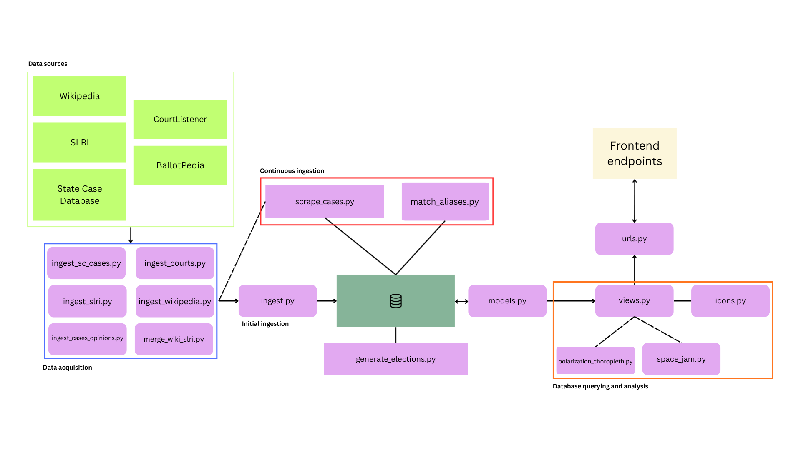
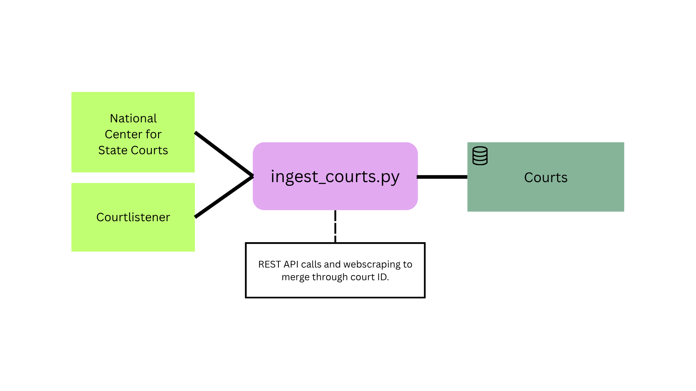
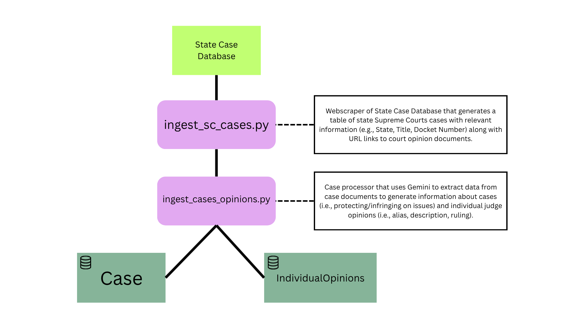
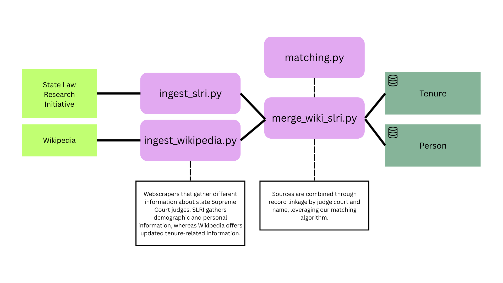
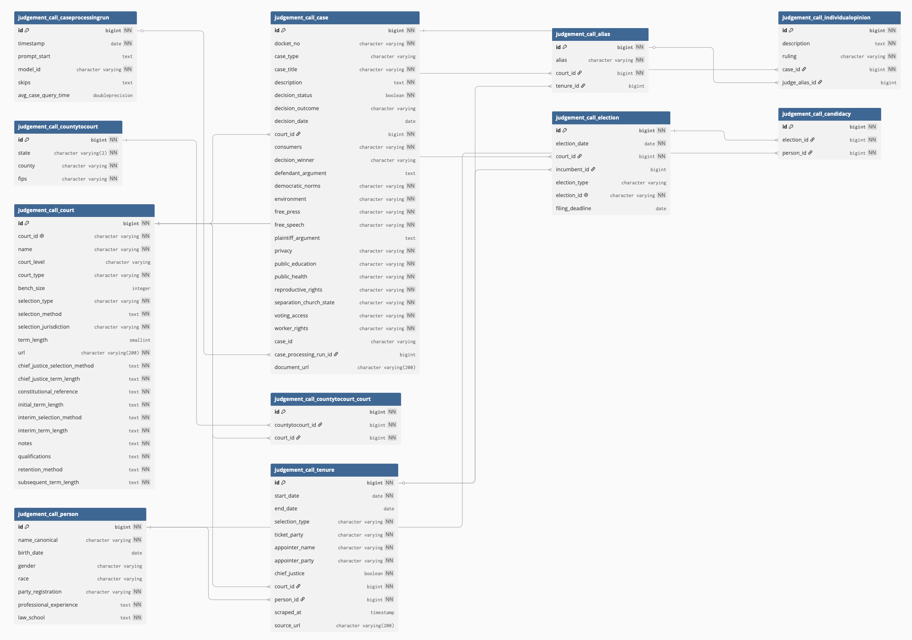
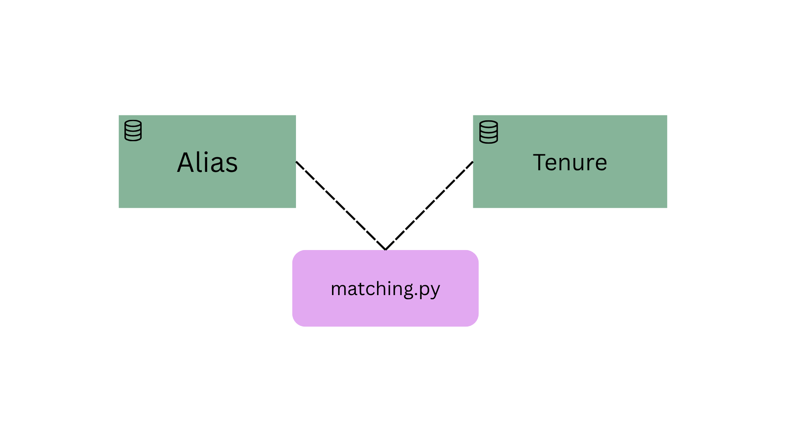
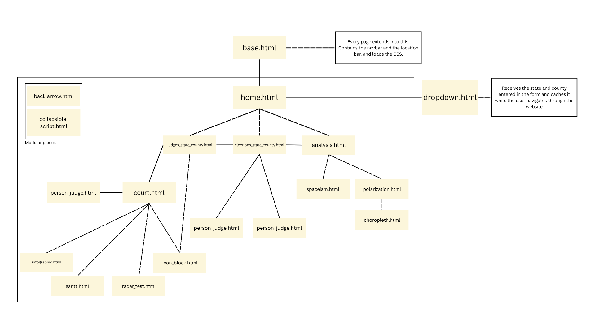

## Architecture

The Judgement Call project is aimed at informing voters and citizens about their judges by centralizing and synthesizing relevant information about existing judges, and candidates in judicial elections.

The project pulls data from a variety of sources to provide a centralized resource for voters in judicial elections.

### Data acquisition and pre-processing

Data acquisition and pre-processing operation occurs in two contexts:

1. *Initial ingestion*: this is the import that takes several hours to run and produces all of the data required to use the application.
2. *Continuous ingestion:* this is an import that runs every evening, updating the database with the latest information on cases.

#### Courts

The information regarding courts are merged from the outputo of webscraping and REST API calls.

#### Cases & individual opinions

Our information regarding the cases, and the individual opinions of each judge on a case, is acquired through a progression of webscraping and processing through Google's large language model (LLM) Gemini.

#### Judges

The information regarding judges, ranging from tenure specifics to demographics, is acquired through a process of webscraping and record linkage.

#### Elections & Candidates

Our current information regarding elections and candidates was manually webscraped from BallotPedia.

### Insertion into database

The previous high-level summaries of data acquisition produce `.csv` files that are then entered into the database through the management command designed in `ingest.py`. This uses an additional geographic component populating a `countytocourt` table that leverages Python's `us` library to match court ID codes from CourtListener with counties and states.

### Backend processing

Once the data makes its way into the database, the app works with the following data model:

The most relevant sections of the backend consist of making queries using Django's ORM to produce views of judges and people, performing analysis, and management commands:

#### match_aliases.py

As individual judge opinions entered the database, the aliases that appeared on court documents were stored in an `Alias` table. We used a record linkage command designed in `utils/matching.py` to match these aliases to actual Judge tenures (with a current match rate of ~57%).

#### generate_elections.py

Although this command is not called in the ingestion pipeline, it deduces election dates in courts based off of records in the `Tenure` table using their selection type and term end.

#### scrape_cases.py

This command is at the core of this application's continuous ingestion of data. It is run every night along with `match_aliases`. It performs an incremental webscrape of State Case Database and repeats data processing through Gemini before entering them into the database. This process updates the `Case`, `IndividualOpinion`, `CaseProcessingRun`, and `Alias` tables.

#### views.py

This file contains a crucial component for this application's functioning which is the creation of speed views (Django ORM query results and additional computation) that respond to endpoints on the frontend. There are a few key functions in this file:

- *full_court_view()*: this function fetches a single court by ID using state and county geographic information, queries all of the current judge tenures for that state, and performs high level computations on the court (e.g., average age, race breakdown, etc).

- *show_person()*: this function is a combination of others that centralizes information about a given person including every tenure they've held, all of the cases they rules on, how they generally ruled on those cases, and demographic information.

- *elections_state_county()*: this function gathers election future near elections given a court's identifiable geographic information from the `Elections` table and generates a list of candidates when applicable.

- *analysis_state_county()*: this function uses a court's information to prepares data for the Gantt chart of a court's tenures, and performs the radar computation.

#### icons.py

This file contains that code that is deployed when deciding what icons appear next to a judge. It computes simple badges describing a judge's tenure (i.e., if they've been there for long & if their tenure is almost finished). It then goes through a series of computations to generate each tenures' topic icons, deducing if a judge has a tendency to infringe/protect a specific civil right from the `IndividualOpinion` table.

#### Analysis

Our analysis module contains the code that creates the polarization choropleth as and the spacejam visualizations. These are designed to be responsive to the outputs from the classes in `forms.py`.

### Front end

#### Connection to backend

The `urls.py` file is the dictionary that connects the endpoints that require loading data from the database with the Django ORM queries written in `views.py`.

#### Structure

The different page templates are shown in the chart below in relation to each other:

### Architecture limitations

The current architectures overrelies on `.csv` files. Every script in the `ingestion` module outputs `.csv` files. A future data engineering task should remove the intermediate step.

The current record linkage project only has a match-rate of ~57%, leaving 43% of individual opinions unmatched to a real tenure. Improvement on this matching rate requires more refined record linkage, and real data on previous tenures.

The radar chart is limited to only showing the last two judges that were selected. A more dynamic method of selecting judges for the radar charts is in order for future improvement.

There is no mechanism to update the elections and candidacies after the 2026 election. Similarly, there is no mechanism to update the judges.